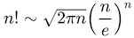
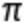

# stirling
`stirling` calculates an approximation for factorials using [Stirling's formula](https://en.wikipedia.org/wiki/Stirling%27s_approximation).

### Method
The approximation is done using the equation  where the value of  is calculated using [libpi](https://github.com/mathinjenkins/libpi), the value of `e` is calculated using [libeuler](https://github.com/mathinjenkins/libeuler). The square root is calculated using [libsqrt](https://github.com/mathinjenkins/libsqrt), and the exponent is caclucated using [libexponent](https://github.com/mathinjenkins/libexponent).

Note that all of the used libraries (except `libexponent`) use some sort approximation to get the result. Therefore, the value of the factorial using this implementation of stirling formula is **not** accurate. In fact, since approximations are chained, the value might be badly inaccurate. This is intentional for thr purpose of the illustration of this project as outlined in [What is Math in Jenkins?](https://github.com/mathinjenkins/README)

### Dependencies
* [libexponent](https://github.com/mathinjenkins/libexponent)
* [libeuler](https://github.com/mathinjenkins/libeuler)
* [libsqrt](https://github.com/mathinjenkins/libsqrt)
* [libpi](https://github.com/mathinjenkins/libpi)

### Prerequisites
* `cmake`
* `gcc` or `clang`

### Build
* `git clone --recursive git@github.com:mathinjenkins/stirling.git`
* `cd stirling`
* `./build.sh`

### License
[MIT License](https://github.com/mathinjenkins/stirling/blob/master/LICENSE)
